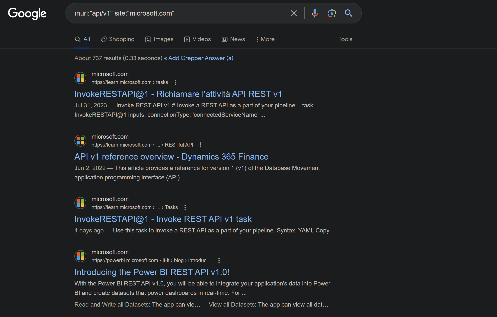

## Introduction

In almost every penetration testing, gathering information about the intended target is the first task to complete. In API pentesting, it is mainly about finding the api endpoint. This can be achieved by digging through documentation on the target website, wayback machine, git repos, etc
Another method is to use the browser developer tools to dig through the network connections to discover api's

### URL Schemes

The common indicators and structure that you have discovered an api.

<https://target-name.com/api/v1>

<https://api.target-name.com/v1>

<https://target-name.com/docs>

<https://dev.target-name.com/rest>

Look for API indicators within directory names like:
/api, /api/v1, /v1, /v2, /v3, /rest, /swagger, /swagger.json, /doc, /docs, /graphql, /graphiql, /altair, /playground

Also, subdomains can also be indicators of web APIs:

api.target-name.com

uat.target-name.com

dev.target-name.com

developer.target-name.com

test.target-name.com

## Passive Reconnaissance

It is the act of gathering information about a target without directly interacting with the target.
Information of interests are usually:

- API endpoints
- Exposed Credentials
- API versions eg <http://example.com/v1>, <http://example.com/v2>
- API documentation
- API's business purpose

### Google Dorking

It is the search techniques used to find precise(relevant) information about an object

|Google Dorking Query | Expected results |
|:-------------------: | :----------------:|
|inurl:"/wp-json/wp/v2/users" | Finds all publicly available WordPress API user directories|
|intitle:"index.of" intext:"api.txt" | Finds publicly available API key files|

Check <https://exposingtheinvisible.org/guides/google-dorking/> for detailed information on google dorking



### Git Dorking

Most developers use git for version control and collaboration. It is a great place to search sensitive data exposures such as api keys, credentials used for testing which might still work, tokens, etc.
Go to [GitHub](https://github.com) and search for repo of your target. You can specify extensions such as json and if you have knowledge of framework they are using for their website, you can check the directories such as server/api for Nuxt3 framework and .env files for sensitive data. It is a good idea to skim through the commits. They might have exposed sensitive data previously and removed it later but they will still be there in the commits(talking from experience).

Some search terms:

- authorization:bearer
- filename:swagger-file
- extension:"json" [target name]

### TruffleHog

You can also try [trufflehog](https://github.com/trufflesecurity/trufflehog) on github to search for verified secret of your target repo.

### Shodan

Go to [shodan](shodan.io) and search for information on your target using terms "content-type:application/json", "wp-json", etc

### Wayback Machine

If the target has public api available, you can use the [wayback machine](https://web.archive.org) for changes in their api documentation over the years. And if there is any vulnerability due to things like improper asset management then voila

## Active Reconnaissance

In passive recon we were just digging around the target for any useful information that will help us at this stage and subsequent stages. But, in **active recon** , we will now directly interact with the target to further gather more information.
Remember,
>Every pentester is as good as their information gathering skills - Andrews

### Start crAPI

```sh
cd ~/lab/crapi
sudo docker-compose up -d
```

## Quiz
