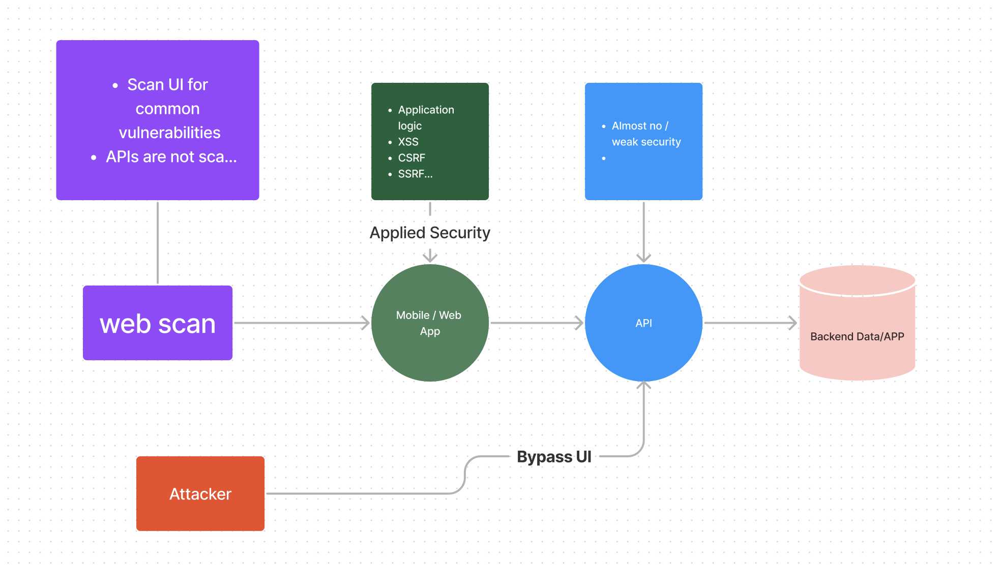

## Introduction

Let's study why API is important and why it is relevant to PCI.

1. API adoption has exploded over the last few decades. It makes about 83% of all internet traffic according to Akamai. It virtually powers everything such as banking, hospital systems, smart gadgets, etc
2. APIs are heavily under attack with about $41B - $75B average API-related cyber loss.
3. APIs are also mostly not secured. Security of APIs are nearly negligible with only some basic security measures put in place. Traditionally, software, web and mobile developers have heavily relied on the UI to filter data end users can see leaving the API endpoints with almost no security at all.

## API attacks are Different

Normally, developers use SAST and DAST to scan and test for common vulnerabilities such as injection attacks, XSS, CSRF, SSRF, misconfigurations, etc.
However, API attacks are normally focused on the weakness in application logic, authorization  gaps, weak/no authentication, etc.

From the above picture, we notice

- Web scanners scan only the UI(user interface) leaving  the API
- All security implementations are usually done at the UI level leaving the weakly protected
- Attackers can bypass the UI and attack the API directly for sensitive data.

**Suggest** Taking a look at the fundamental API course(free) by APIsec University and OWASP API security top 10 course by APIsec University and other MOOC's
